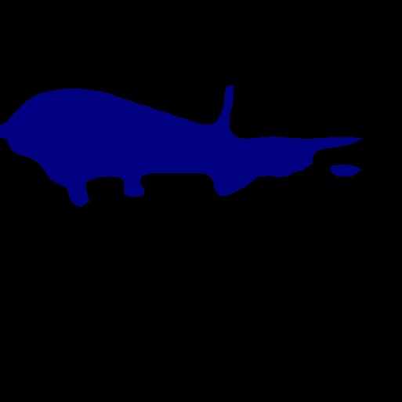

# DeepLab-V1-PyTorch

## 1. 原始项目地址
```
https://github.com/wangleihitcs/DeepLab-V1-PyTorch
```
## 2. 下载预训练模型
- deeplab_largeFOV.pth：官方下载地址为[https://github.com/wangleihitcs/DeepLab-V1-PyTorch/blob/master/data/deeplab_largeFOV.pth](https://raw.githubusercontent.com/wangleihitcs/DeepLab-V1-PyTorch/refs/heads/master/data/deeplab_largeFOV.pth)
- 本项目预训练模型存储路径：../../02_models/pretrained_models/deeplab_largeFOV.pth
- 本项目已训练模型存储路径：../../02_models/fgai_trained_models/chapter07/08_DeepLab-V1-PyTorch/model_last.pth
## 3. fgai-cv-basis运行方式
```
cd chapter07/08_DeepLab-V1-PyTorch
# 复制预训练模型data目录下
cp ../../02_models/pretrained_models/deeplab_largeFOV.pth data/

# 训练程序，模型文件保存于chapter07/08_DeepLab-V1-PyTorch/exp/model_last.pth
python main.py --type train

# 推理程序，推理结果保存于chapter07/08_DeepLab-V1-PyTorch/exp/labels
python main.py --type test
```


## 以下为原项目Readme


Code for ICLR 2015 deeplab-v1 paper ["Semantic Image Segmentation with Deep Convolutional Nets and Fully Connected CRFs"](http://arxiv.org/pdf/1412.7062.pdf), backbone is deeplab-largeFOV.

## Config
- python 3.7 / pytorch 1.2.0
- pydensecrf
- opencv

## Datasets
- [Pascal VOC 2012 Dataset](http://host.robots.ox.ac.uk/pascal/VOC/voc2012/)
    - extract 'VOCtrainval_11-May-2012.tar' to 'VOCdevkit/'
- [Pascal VOC 2012 Augment Dataset](https://github.com/shelhamer/fcn.berkeleyvision.org/tree/master/data/pascal)
    - I have download it, 'VOCdevkit/SegmentationClassAug.zip', you show extract it to 'VOCdevkit/VOC2012/
Finally, it should like this
```
/VOCdevkit
└── VOC2012
    ├── Annotations
    ├── ImageSets
    ├── JPEGImages
    ├── SegmentationObject
    └── SegmentationClass
    └── SegmentationClassAug
```

## Performance
### Compore with paper
<table>
    <tr>
        <th>Train set</th>
        <th>Eval set</th>
        <th>CRF?</th>
        <th>Code</th>
        <th>Pixel<br>Accuracy</th>
        <th>Mean<br>Accuracy</th>
        <th>Mean IoU</th>
        <th>FreqW IoU</th>
    </tr>
    <tr>
        <td rowspan="4">
            <i>trainaug</i><br>
        </td>
        <td rowspan="4"><i>val</i></td>
        <td rowspan="2"></td>
        <td>DeepLab-LargeFOV</td>
        <td>-</td>
        <td>-</td>
        <td><strong>62.25</strong></td>
        <td>-</td>
    </tr>
    <tr>
        <td>Ours-step</td>
        <td>90.20</td>
        <td>80.92</td>
        <td><strong>62.34</td>
        <td>83.58</td>
    </tr>
    <tr>
        <td rowspan="2">&#10003;</td>
        <td>DeepLab-CRF-LargeFOV</td>
        <td>-</td>
        <td>-</td>
        <td><strong>67.64</strong></td>
        <td>-</td>
    </tr>
    <tr>
        <td>Ours-step</td>
        <td>92.23</td>
        <td>79.99</td>
        <td><strong>67.58</strong></td>
        <td>86.32</td>
    </tr>
</table>
e.g. We use ImageNet-1000 to train a classification task for backbone DeepLab-LargeFOV（VGG16）。

### Learning rate policy
<table>
    <tr>
        <th>Train set</th>
        <th>Eval set</th>
        <th>CRF?</th>
        <th>Code</th>
        <th>Pixel<br>Accuracy</th>
        <th>Mean<br>Accuracy</th>
        <th>Mean IoU</th>
        <th>FreqW IoU</th>
    </tr>
    <tr>
        <td rowspan="6">
            <i>trainaug</i>
        </td>
        <td rowspan="6"><i>val</i></td>
        <td rowspan="3"></td>
        <td>Ours-step</td>
        <td>90.20</td>
        <td>80.92</td>
        <td><strong>62.34</td>
        <td>83.58</td>
    </tr>
    <tr>
        <td>Ours-poly</td>
        <td>91.24</td>
        <td>80.29</td>
        <td><strong>64.838</td>
        <td>85.00</td>
    </tr>
    <tr>
        <td>Ours-poly2</td>
        <td>91.35</td>
        <td>81.61</td>
        <td><strong>65.44</td>
        <td>85.26</td>
    </tr>
    <tr>
        <td rowspan="3">&#10003;</td>
        <td>Ours-step</td>
        <td>92.23</td>
        <td>79.99</td>
        <td><strong>67.58</strong></td>
        <td>86.32</td>
    </tr>
    <tr>
        <td>Ours-poly</td>
        <td>92.65</td>
        <td>79.92</td>
        <td><strong>68.72</strong></td>
        <td>86.98</td>
    </tr>
    <tr>
        <td>Ours-poly2</td>
        <td>92.89</td>
        <td>80.39</td>
        <td><strong>69.60</strong></td>
        <td>87.35</td>
    </tr>
</table>
e.g. The learning rate policy of "step" and "poly", mentioned by [deeplab v2](http://arxiv.org/pdf/1606.00915.pdf). Ours-poly2 means to add scale method to dataset augment.

## Usage
### Train
```
python main.py --type=train
```
### Test
without CRF
```
python main.py --type=test
```

with CRF
```
python main.py --type=test --use_crf
```

### Evaluate
```
python evalate.py
```

## References
1. Liang-Chieh Chen*, George Papandreou*, Iasonas Kokkinos, Kevin Murphy, and Alan L. Yuille. (*equal contribution). Semantic Image Segmentation with Deep Convolutional Nets and Fully Connected CRFs. ICLR,
2015.<br>
[Project](http://liangchiehchen.com/projects/DeepLab.html) /
[Code](https://bitbucket.org/aquariusjay/deeplab-public-ver2) / [arXiv
paper](http://arxiv.org/pdf/1412.7062.pdf)

2. [deeplab-v2-pytorch](https://github.com/kazuto1011/deeplab-pytorch)
