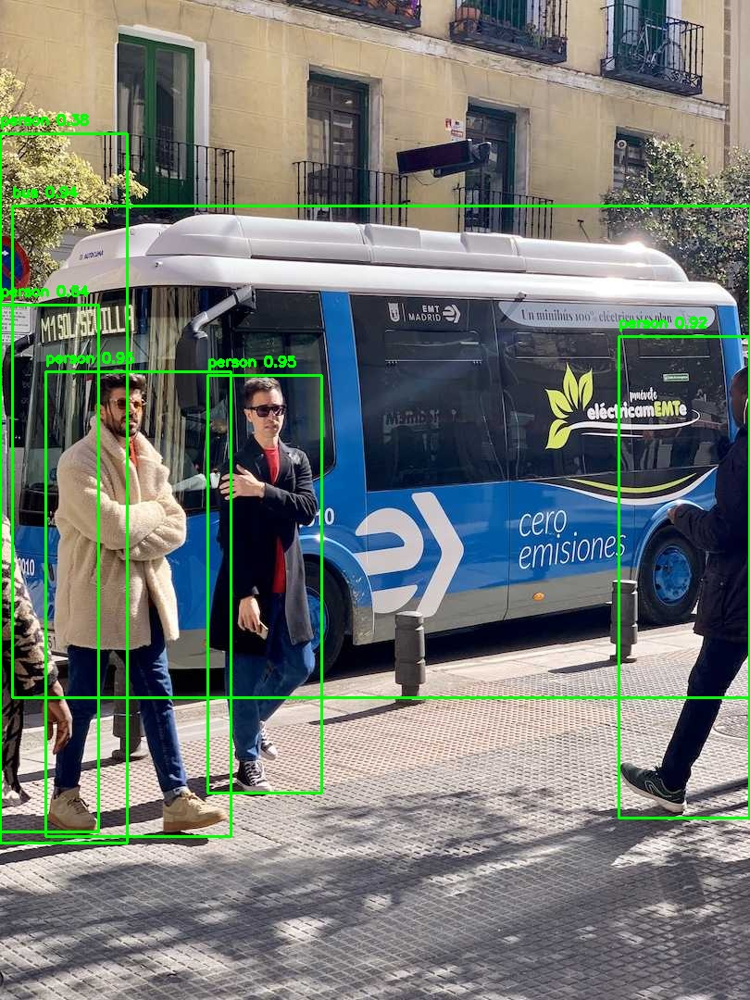

## 1. 原始项目地址
```
https://github.com/ultralytics/ultralytics
```
## 2. 下载预训练模型
- 如果未下载预训练模型，程序会自动下载。
- 下载预训练模型到chapter08/07_yolov8目录下
- 官方下载地址： 
```
https://github.com/ultralytics/assets/releases/download/v8.3.0/yolov8s.pt
https://github.com/ultralytics/assets/releases/download/v8.3.0/yolo11n.pt
```
- 本项目预训练模型存储路径：
```
../../02_models/pretrained_models/yolov8s.pt    
../../02_models/pretrained_models/yolo11n.pt
```
- 本项目已训练模型存储路径：../../02_models/fgai_trained_models/chapter08/07_yolov8/best.pt
## 3. fgai-cv-basis运行方式
```
# 数据集配置文件
chapter08/07_yolov8/data/coco128.yaml

cd chapter08/07_yolov8/
# 训练程序，模型文件保存于chapter08/07_yolov8/runs/detect/train<id>/weights/best.pt
python train.py

# 单张推理程序，推理结果保存chapter08/07_yolov8/demo.jpg
python demo.py
```

